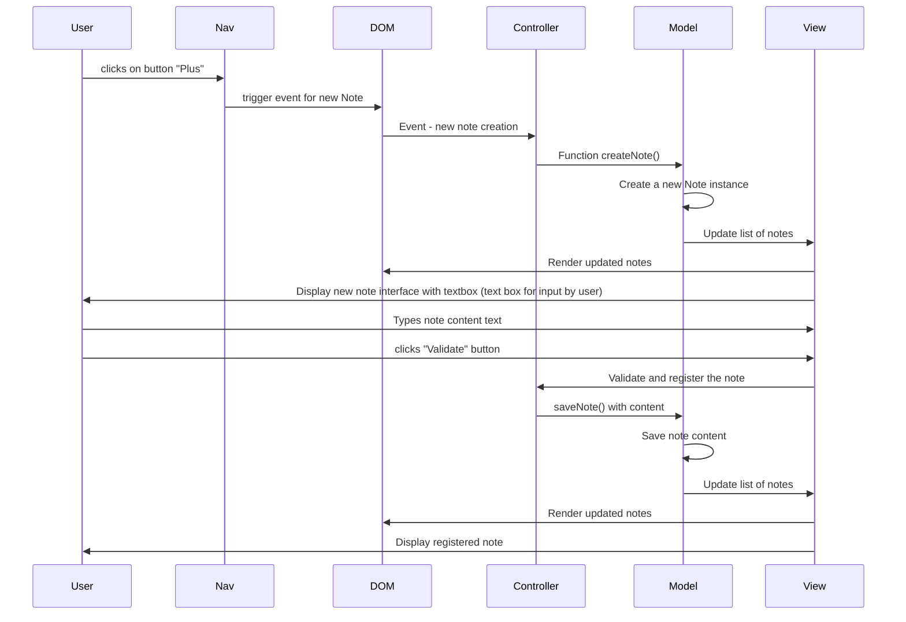
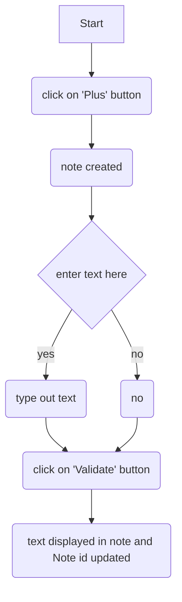
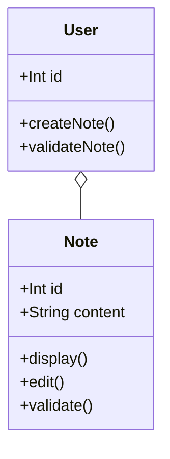

# Sexta 
Retro Engineering Exercise

## Methodology
1. Clone https://gitlab.com/Nasyourte/exo-retroengineering

2. Explore the application. Run to note the different features and workflows

Screen states
1. Plus button, Header
2. Upon click plus creates a new note
3. note can be edited → input 
4. note is saved → displayed

## Use cases and Scenarios
Indentifying the use cases.
1. Creating a new note
    1. Actor : User
    2. Description : user clicks PLUS button to create a new note
    3. pre condition : user is on main app screen
    4. post condition : a new note is created and displayed in the notes list
2. View all notes
    1. actor: user
    2. description: user views list of all notes

**Scenarios**

**UC 1 **
User clicks PLUS button

Note opens with text area for note

User enters text and clicks VALIDATE

note appears in notes list

**UC 2**

- User navigates to the main application screen.
- All existing notes are displayed in the notes container.

### Use case diagrams

## Sequence Diagram

### Explanation of the Sequence

1. **User Interaction**:
    - The **User** clicks the "Plus" button in the nav , signaling intent to create a new note.
2. **Navigation Handling**:
    - The **Nav** component captures this click and triggers an event, notifying the DOM (Document Object Model).
3. **DOM Event Trigger**:
    - The **DOM** forwards this event to the **Controller**, indicating that the user wants to create a new note.
4. **Controller Action**:
    - The **Controller** calls the `createNote()` function on the **Model** to initiate the creation of a new note.
5. **Model Processing**:
    - The **Model** creates a new **Note** instance, which represents the note data.
    - This might involve initializing attributes like ID, content, created date, etc.
6. **Updating the View**:
    - Once the note is created, the **Model** sends an update to the **View** to reflect the new state of the notes list.
7. **Rendering to DOM**:
    - The **View** interacts with the **DOM** to render the updated list of notes, including the new note interface.
8. **User Interface Update**:
    - Finally, the **View** displays the new note interface to the **User**, allowing them to enter content for the new note.

## Activity Diagram

## Class Diagram

This indicates a composition relationship
where a `User` can have multiple `Note` instances associated with them.

The use of `o--` suggests that the `Note` instances are dependent on the `User` for their lifecycle (e.g., a note cannot exist without a user)

In a practical sense, when a user is created, they can create and manage their own notes, and if the user is deleted, the associated notes may also be removed, emphasizing the relationship.

## Wireframe

