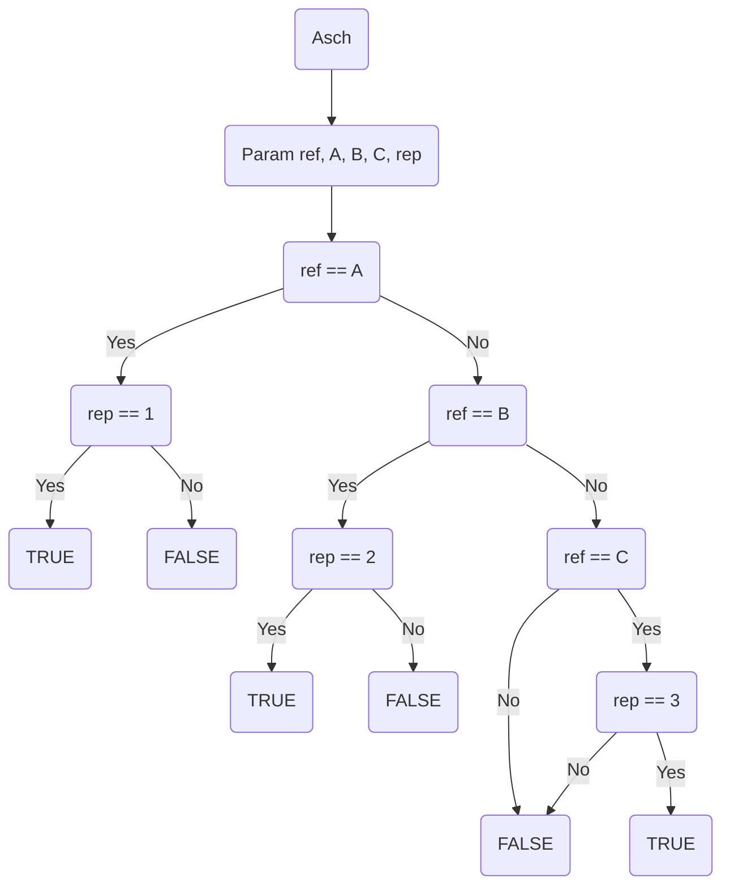

# 8. Octavia

## Alpha

- **Le modèle des données en entrée et en sortie**

INPUT

longueur des lignes: comparison line A, B, C
reference line: Ref
answer given by participants: True/ False

OUTPUT
answers : true/ false

- **Le modèle du dataset d'entraînement**

length of lines: numerical values A, B, C, reference
answers by participants: true/ false

- **L’arbre qui, selon vous, permettrait de donner la bonne réponse à chaque fois**

